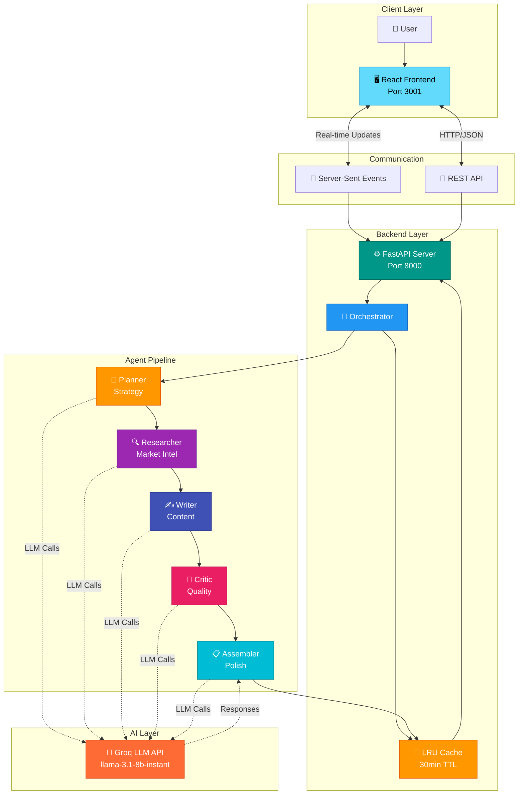

# 🚀 FlowForge AI

<div align="center">


**Enterprise-grade multi-agent AI system for automated marketing content generation**

Transform ideas into complete marketing campaigns in 30 seconds with 5 specialized AI agents working in perfect harmony.

[Features](#-features) • [Quick Start](#-quick-start) • [Deploy](#-deployment) • [API Docs](#-api-reference)

</div>

---

## 📖 Overview

**FlowForge AI** orchestrates 5 autonomous AI agents that collaborate to generate professional marketing campaigns. Built on FastAPI and Groq LLM, it delivers production-ready content in under 60 seconds.

### 🎯 Key Benefits

| Traditional | FlowForge AI |
|------------|--------------|
| ⏰ 8-12 hours per campaign | ⚡ 30-60 seconds |
| 🔄 Multiple revision cycles | ✅ Single-pass generation |
| 💰 High operational cost | 💸 Minimal cost (Groq LLM) |
| 👥 Multiple specialists needed | 🤖 One-click automation |

### 🤖 Agent Pipeline

```
User Input → 🎯 Planner → 🔍 Researcher → ✍️ Writer → 🔎 Critic → 📋 Assembler → Marketing Brief
```

**Agent Roles:**
- **Planner**: Strategic analysis and execution strategy
- **Researcher**: Market intelligence and competitive insights
- **Writer**: Data-driven content creation
- **Critic**: Quality assurance and enhancement
- **Assembler**: Final polish and formatting

---

## ✨ Features

- 🎨 **Modern UI**: Responsive dark/light themes with real-time progress tracking
- ⚙️ **Production-Ready**: Multi-agent orchestration with intelligent caching and SSE streaming
- 🔌 **Developer-Friendly**: RESTful API with OpenAPI, WebSocket support, easy cloud deployment
- 🚀 **High Performance**: Groq LLM (llama-3.1-8b-instant) for lightning-fast inference
- 💾 **Smart Caching**: LRU cache with 30-minute TTL for instant repeated requests

---

## 🚀 Quick Start

### Prerequisites

- **Node.js 18+** and npm
- **Python 3.10+**
- **Groq API Key** (free): [Get yours here](https://console.groq.com/)

### Local Setup

```bash
# 1. Clone repository
git clone https://github.com/YatindraRai002/FlowForge-AI.git
cd FlowForge-AI

# 2. Backend setup
cd backend
python -m venv .venv
.venv\Scripts\activate          # Windows
# source .venv/bin/activate     # macOS/Linux

pip install -r requirements.txt

# 3. Configure environment
copy .env.example .env          # Windows
# cp .env.example .env          # macOS/Linux

# Edit backend/.env:
# GROQ_API_KEY=your_groq_api_key_here
# GROQ_MODEL=llama-3.1-8b-instant

# 4. Frontend setup
cd ..
npm install

# 5. Start application
# Terminal 1: cd backend && .venv\Scripts\activate && python main.py
# Terminal 2: npm run dev
```

### Access Points

| Service | URL | Description |
|---------|-----|-------------|
| 🖥️ Frontend | `http://localhost:3001` | React UI |
| ⚙️ Backend API | `http://localhost:8000` | FastAPI Server |
| 📚 API Docs | `http://localhost:8000/docs` | Swagger UI |

---

## ☁️ Deployment

### Deploy to Render.com (5 minutes)

#### Backend Service

1. Go to [Render Dashboard](https://dashboard.render.com) → **New+ → Web Service**
2. Connect GitHub: `YatindraRai002/FlowForge-AI`
3. Configure:
   - **Name**: `flowforge-backend`
   - **Root Directory**: `backend`
   - **Environment**: `Python 3`
   - **Build Command**: `pip install -r requirements.txt`
   - **Start Command**: `uvicorn main:app --host 0.0.0.0 --port $PORT`

4. **Environment Variables**:
   ```env
   GROQ_API_KEY=your_groq_api_key_here
   GROQ_MODEL=llama-3.1-8b-instant
   PYTHON_VERSION=3.11.0
   ```

5. Deploy and copy your backend URL

#### Frontend Service

1. **New+ → Web Service** → Same GitHub repo
2. Configure:
   - **Name**: `flowforge-ai`
   - **Environment**: `Node`
   - **Build Command**: `npm install && npm run build`
   - **Start Command**: `npm run start`

3. **Environment Variables**:
   ```env
   VITE_API_URL=https://your-backend-url.onrender.com
   NODE_VERSION=22.12.0
   ```

4. Deploy and access your app!

### Verification

```bash
# Health check
curl https://your-backend.onrender.com/health

# Expected response:
{"status": "healthy", "provider": "groq", "model": "llama-3.1-8b-instant"}
```

---

## 📡 API Reference

### Start Workflow

```bash
curl -X POST http://localhost:8000/api/workflow/start \
  -H "Content-Type: application/json" \
  -d '{
    "request": "Launch campaign for AI productivity app targeting remote workers",
    "tone": "professional",
    "length": "medium",
    "format": "marketing brief"
  }'
```

**Response:**
```json
{
  "workflow_id": "uuid-here",
  "status": "started",
  "message": "Workflow started successfully"
}
```

### Stream Progress (SSE)

```bash
curl -N http://localhost:8000/api/workflow/stream/{workflow_id}
```

### Get Result

```bash
curl http://localhost:8000/api/workflow/result/{workflow_id}
```

**Response:**
```json
{
  "workflow_id": "uuid-here",
  "status": "completed",
  "result": {
    "title": "AI Productivity App Campaign",
    "summary": "Executive summary...",
    "body": "Full markdown content...",
    "raw": "Raw markdown text"
  },
  "execution_time": 45.2
}
```

---

## 🏗️ Architecture

### System Overview



### Tech Stack

**Backend:**
- FastAPI (async/await)
- Groq LLM (llama-3.1-8b-instant)
- LangChain integration
- Pydantic validation

**Frontend:**
- React 19
- Vite
- TailwindCSS
- Framer Motion

**Infrastructure:**
- Server-Sent Events (SSE)
- LRU caching with TTL
- Exponential retry logic
- Production-ready error handling

### Project Structure

```
FlowForge-AI/
├── backend/
│   ├── agents/          # 5 specialized AI agents
│   ├── utils/           # Groq client, event bus
│   ├── llm_factory.py   # Centralized LLM configuration
│   ├── orchestrator.py  # Workflow orchestration
│   └── main.py          # FastAPI application
├── frontend/
│   └── src/
│       ├── pages/       # React pages
│       └── components/  # Reusable components
└── README.md
```

---

## 🎯 Use Cases

- **Product Launches**: Complete go-to-market strategies in 45 seconds
- **Social Media**: Platform-specific campaigns with hashtag strategies
- **Rebranding**: Brand positioning and messaging frameworks
- **API Integration**: Automated campaign generation for marketing platforms

---

## 🔧 Configuration

### Supported Groq Models

| Model | Use Case | Speed | Quality |
|-------|----------|-------|---------|
| `llama-3.1-8b-instant` | **Default** - Fast responses | ⚡⚡⚡ | ⭐⭐⭐ |
| `mixtral-8x7b-32768` | Better reasoning | ⚡⚡ | ⭐⭐⭐⭐ |
| `llama-3.1-70b-versatile` | Maximum capability | ⚡ | ⭐⭐⭐⭐⭐ |

### Environment Variables

```env
# Required
GROQ_API_KEY=your_groq_api_key_here
GROQ_MODEL=llama-3.1-8b-instant

# Optional
LLM_TEMPERATURE=0.2
LLM_MAX_TOKENS=2048
PORT=8000
HOST=0.0.0.0
LOG_LEVEL=INFO
```

---

## 📝 License

MIT License - see [LICENSE](LICENSE) file for details.

---

## 🤝 Contributing

Contributions are welcome! Please feel free to submit a Pull Request.

---

## 📧 Support

For issues and questions:
- 🐛 [GitHub Issues](https://github.com/YatindraRai002/FlowForge-AI/issues)
- 📖 [Documentation](https://github.com/YatindraRai002/FlowForge-AI)

---

<div align="center">

**Built with ❤️ using FastAPI, React, and Groq LLM**

⭐ Star this repo if you find it useful!

</div>
