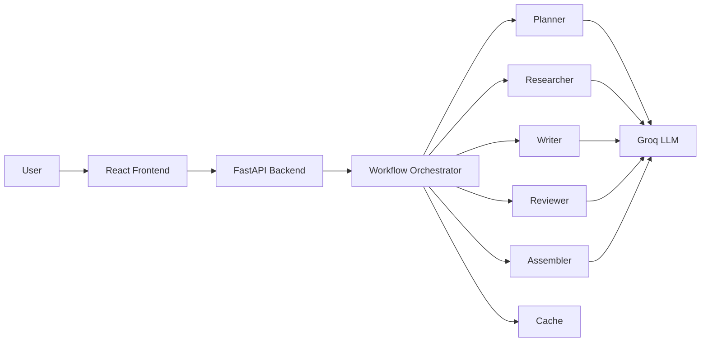

# 🚀 FlowForge AI

FlowForge AI is a **multi-agent marketing automation system** that generates complete marketing campaigns in seconds using AI.

Built with **FastAPI + React + Groq LLM**, it automates planning, research, content creation, review, and final assembly.

## ✨ Features

- Multi-agent AI workflow
- Real-time progress streaming (SSE)
- Smart caching for faster responses
- Groq-powered LLM inference
- Modern React frontend
- FastAPI backend
- Exportable marketing briefs

---

## 🏗 Architecture



### Workflow

```text
User Input
   ↓
Planner
   ↓
Researcher
   ↓
Writer
   ↓
Reviewer
   ↓
Assembler
   ↓
Final Marketing Brief
```

---

## 🛠 Tech Stack

### Frontend
- React
- TailwindCSS
- Framer Motion

### Backend
- FastAPI
- Pydantic
- Async Python

### AI
- Groq LLM
- Multi-Agent Orchestration

---

## 🚀 Quick Start

```bash
# Clone repo
git clone https://github.com/YatindraRai002/FlowForge-AI.git

# Backend
cd backend
pip install -r requirements.txt

# Add API key
GROQ_API_KEY=your_api_key

# Run backend
python main.py

# Frontend
cd ..
npm install
npm run dev
```

---

## 📂 Project Structure

```bash
FlowForge-AI/
├── backend/
│   ├── agents/
│   ├── orchestrator.py
│   ├── main.py
│
├── frontend/
│   ├── src/
│   ├── components/
│
└── README.md
```

---

## ⚡ API Endpoints

| Endpoint | Description |
|----------|-------------|
| `/api/workflow/start` | Start workflow |
| `/api/workflow/stream` | Stream progress |
| `/api/workflow/result` | Get final result |

---

## 📜 License

MIT License

---
⭐ Star this repo if you find it useful.
