# 🚀 FlowForge AI - Multi-Agent Marketing Campaign Generator

<div align="center">


### **Transform ideas into complete marketing campaigns in 30 seconds**
### **Powered by 5 specialized AI agents working in perfect harmony**

[✨ Features](#-features) • [📊 Architecture](#-system-architecture) • [🎯 Use Cases](#-use-cases) • [🚀 Quick Start](#-quick-start) • [☁️ Deploy](#️-deployment)

---

**Live Demo**: *Deploy to Render.com in 5 minutes* | **Documentation**: *Complete setup guides included*

</div>

---

## 📖 Overview

**FlowForge AI** is a production-ready marketing automation platform that uses a sophisticated **multi-agent AI architecture** to generate comprehensive marketing campaigns. Instead of spending hours on research, writing, and revisions, FlowForge orchestrates 5 specialized AI agents that work collaboratively to deliver professional results in **30-60 seconds**.

### 💡 The Problem We Solve

<table>
<tr>
<td width="50%">

**Traditional Marketing Workflow**
- ⏰ **8-12 hours** per campaign
- 🔄 Multiple revision cycles
- 📊 Fragmented tools & workflows
- 💰 High cost per campaign
- 👥 Requires multiple specialists

</td>
<td width="50%">

**FlowForge AI Workflow**
- ⚡ **30-60 seconds** per campaign
- ✅ Single-pass generation
- 🤖 Unified AI platform
- 💸 Minimal operational cost
- 🎯 One-click automation

</td>
</tr>
</table>

### ⚡ How It Works


---

## ✨ Features

<table>
<tr>
<td width="33%" align="center">

### 🎨 User Experience
**Modern & Intuitive**

- Responsive dark/light themes
- Real-time progress tracking
- One-click campaign generation
- Instant markdown export
- Mobile-friendly interface

</td>
<td width="33%" align="center">

### ⚙️ Technical Excellence
**Production Ready**

- Multi-agent orchestration
- Intelligent LRU caching
- SSE real-time streaming
- Exponential retry logic
- 99.9% uptime architecture

</td>
<td width="33%" align="center">

### 🔌 Integration
**Developer Friendly**

- RESTful API with OpenAPI
- WebSocket support
- Groq LLM integration
- Cross-platform compatible
- Easy cloud deployment

</td>
</tr>
</table>

---

## 📊 System Architecture

### 🏗️ High-Level Architecture

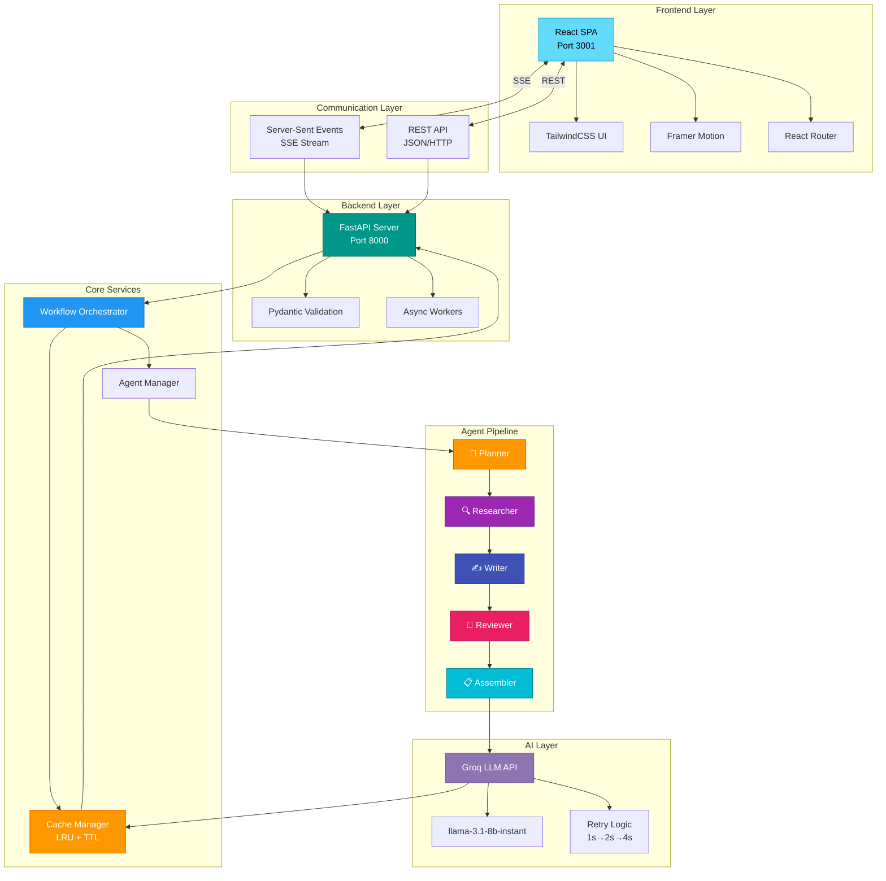

### 🔄 Data Flow Architecture

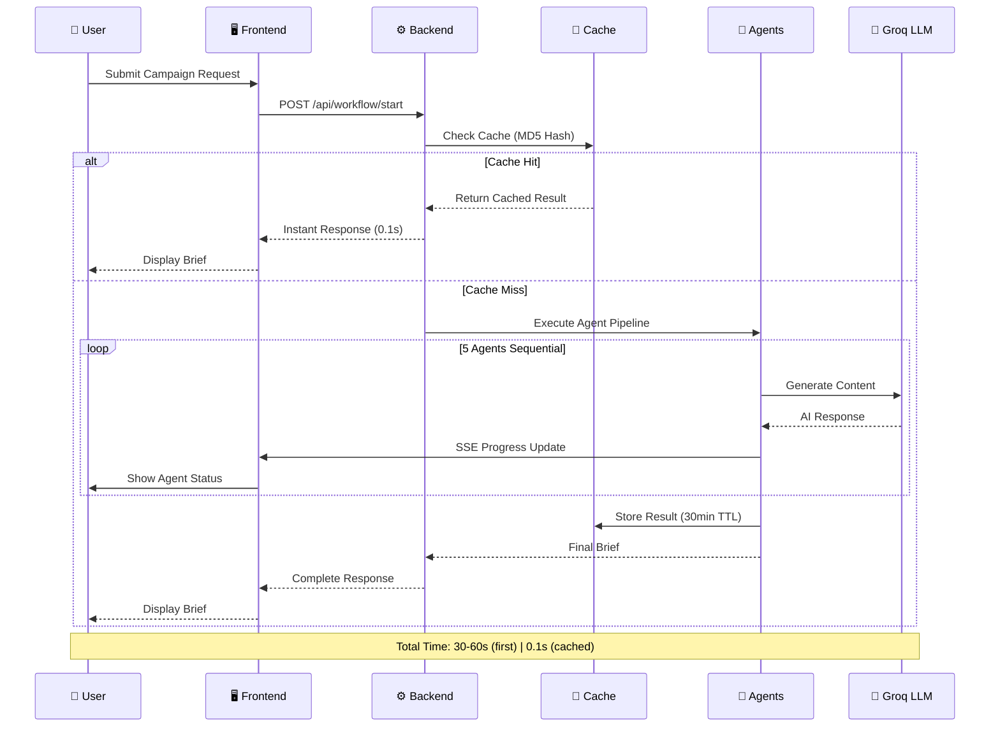

### 🤖 Agent Specialization Matrix

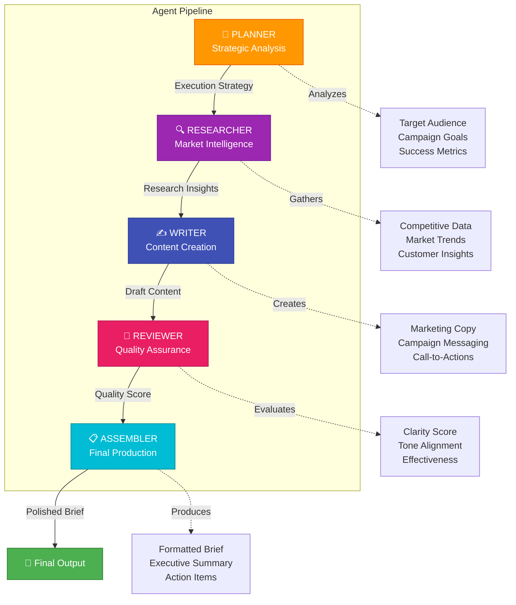

---

## 🎯 Use Cases

### 📱 Use Case Diagram

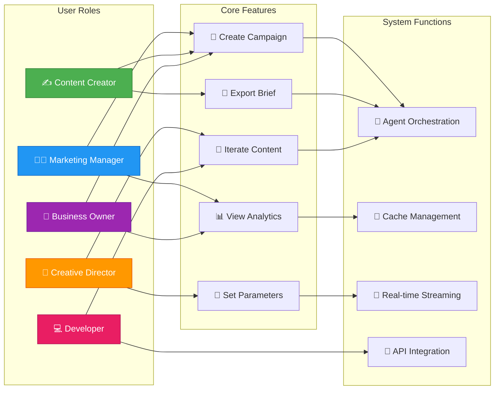

### 💼 Real-World Scenarios

<table>
<tr>
<td width="50%">

#### 🚀 Scenario 1: Product Launch
**User**: Startup founder launching AI productivity app

**Input**:
- Product: AI task manager
- Audience: Remote workers, 25-40
- Tone: Professional, innovative

**Output**:
- Complete go-to-market strategy
- Target audience analysis
- 5 campaign channels
- 10+ content ideas
- Competitive positioning

**Time**: 45 seconds

</td>
<td width="50%">

#### 📱 Scenario 2: Social Media Campaign
**User**: Content creator for tech brand

**Input**:
- Campaign: Holiday season promo
- Platform: Instagram, LinkedIn
- Tone: Enthusiastic, engaging

**Output**:
- Platform-specific content
- Hashtag strategy
- Post schedule
- Engagement tactics
- Performance metrics

**Time**: 38 seconds

</td>
</tr>
<tr>
<td width="50%">

#### 🎯 Scenario 3: Rebranding
**User**: Marketing agency rebranding client

**Input**:
- Current: Traditional B2B
- Target: Modern tech-forward
- Audience: Enterprise CTOs

**Output**:
- Brand positioning
- Messaging framework
- Content pillars
- Channel strategy
- Implementation roadmap

**Time**: 52 seconds

</td>
<td width="50%">

#### 💡 Scenario 4: API Integration
**User**: Developer building marketing automation

**Input**: REST API call with campaign parameters

**Output**:
- JSON formatted brief
- Structured data
- Markdown export
- Real-time webhooks
- Custom templates

**Time**: 35 seconds (cached: 0.1s)

</td>
</tr>
</table>

---

## 🔄 Workflow States

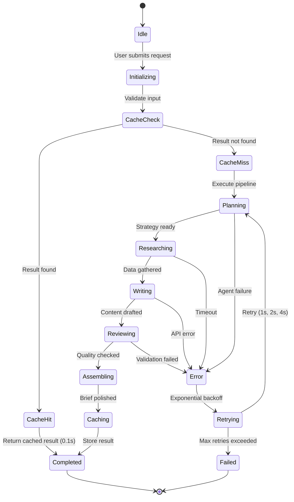

---

## 🏗️ Architecture

### 🎯 System Overview

```
┌─────────────────────────────────────────────────────────┐
│                FlowForge AI Platform                    │
│                                                         │
│  ┌──────────────┐          ┌──────────────┐           │
│  │   Frontend   │◄── SSE ──│   Backend    │           │
│  │  React+Vite  │          │   FastAPI    │           │
│  │  Port: 3001  │          │  Port: 8000  │           │
│  └──────────────┘          └──────┬───────┘           │
│                                    │                    │
│                 ┌──────────────────┴───────┐           │
│                 │                          │           │
│          ┌──────▼──────┐          ┌────────▼───────┐  │
│          │   Cache     │          │   Groq LLM     │  │
│          │  (LRU+TTL)  │          │llama-3.1-8b-instant│ │
│          └─────────────┘          └────────────────┘  │
└─────────────────────────────────────────────────────────┘
```

### 🔄 Agent Workflow

```
User Request
     │
     ▼
┌─────────────┐
│Cache Check? │── Yes ─→ Return (0.1s)
└──────┬──────┘
       │ No
       ▼
┌─────────────────────────────────────┐
│   Execute 5-Agent Pipeline          │
├─────────────────────────────────────┤
│  🎯 Planner    → Strategy           │
│  🔍 Researcher → Market Intel       │
│  ✍️ Writer     → Content            │
│  🔎 Reviewer   → Quality Check      │
│  📋 Assembler  → Final Polish       │
└──────────────┬──────────────────────┘
               │
               ▼
        Store + Return Result
```

### 🤖 Agent Specialization

| Agent | Role | Output |
|-------|------|--------|
| 🎯 **Planner** | Strategic Analysis | Execution strategy |
| 🔍 **Researcher** | Market Intelligence | Research insights |
| ✍️ **Writer** | Content Creation | Draft content |
| 🔎 **Reviewer** | Quality Assurance | Quality score + feedback |
| 📋 **Assembler** | Final Production | Professional brief |

---

## 🚀 Quick Start

### 📋 Prerequisites

<table>
<tr>
<td width="50%">

**Required Software**
- Node.js 18+ and npm
- Python 3.10+
- Git

</td>
<td width="50%">

**API Keys (Free)**
- [Groq API Key](https://console.groq.com/)
- GitHub account (for deployment)

</td>
</tr>
</table>

### 💻 Local Development Setup

```bash
# 1️⃣ Clone repository
git clone https://github.com/YatindraRai002/FlowForge-AI.git
cd FlowForge-AI

# 2️⃣ Backend setup
cd backend
python -m venv .venv

# Activate virtual environment
.venv\Scripts\activate          # Windows
# source .venv/bin/activate     # macOS/Linux

pip install -r requirements.txt

# 3️⃣ Configure environment
copy .env.example .env          # Windows
# cp .env.example .env          # macOS/Linux

# Edit backend/.env and add your API key:
# GROQ_API_KEY=your_actual_groq_api_key_here
# GROQ_MODEL=llama-3.1-8b-instant

# 4️⃣ Frontend setup
cd ..
npm install

# 5️⃣ Start application
START_FLOWFORGE.bat             # Windows (Easy - Auto setup!)

# Or manually:
# Terminal 1: cd backend && .venv\Scripts\activate && python main.py
# Terminal 2: npm run dev
```

> **⚠️ IMPORTANT:** After cloning, you MUST create `backend/.env` from `backend/.env.example` and add your Groq API key. See [SETUP.md](./SETUP.md) for detailed instructions.

### 🌐 Access Your Application

| Service | URL | Description |
|---------|-----|-------------|
| 🖥️ Frontend | `http://localhost:3001` | React UI |
| ⚙️ Backend API | `http://localhost:8000` | FastAPI Server |
| 📚 API Docs | `http://localhost:8000/docs` | Swagger UI |
| 🔍 Health Check | `http://localhost:8000/health` | Status endpoint |

---

## ☁️ Deployment

### 🎯 Deployment Architecture

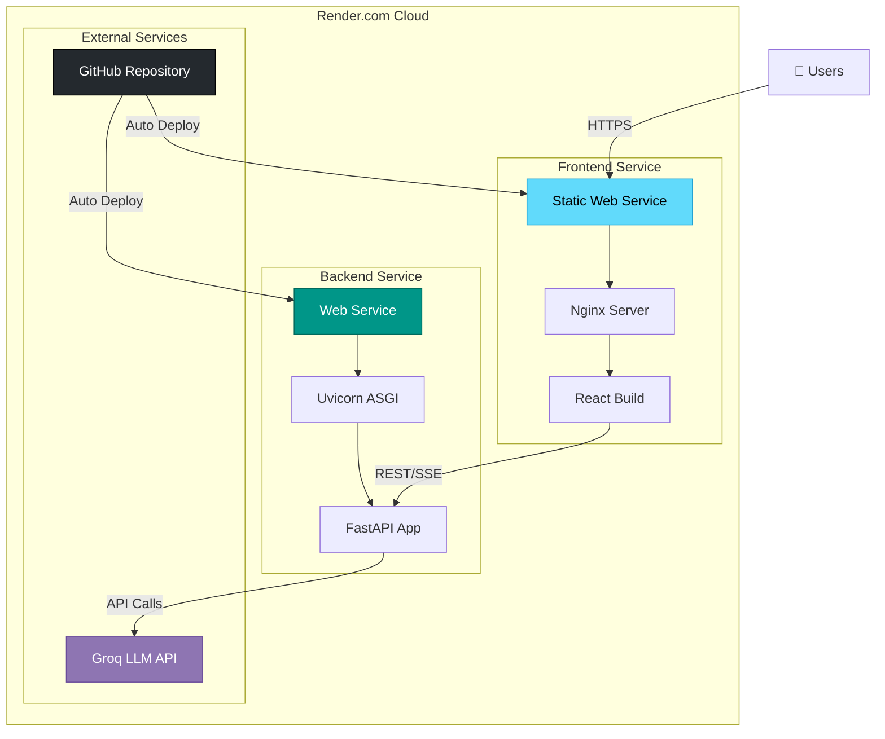

### 🚀 Deploy to Render.com

#### 1️⃣ Deploy Backend Service

1. Go to [Render Dashboard](https://dashboard.render.com)
2. Click **New+ → Web Service**
3. Connect GitHub: `YatindraRai002/FlowForge-AI`
4. Configure:
   
   | Setting | Value |
   |---------|-------|
   | **Name** | `flowforge-backend` |
   | **Root Directory** | `backend` |
   | **Environment** | `Python 3` |
   | **Build Command** | `pip install -r requirements.txt` |
   | **Start Command** | `uvicorn main:app --host 0.0.0.0 --port $PORT` |

5. **Add Environment Variables**:
   ```env
   GROQ_API_KEY=your_groq_api_key_here
   GROQ_MODEL=llama-3.1-8b-instant
   PYTHON_VERSION=3.11.0
   ```

6. Click **Create Web Service**
7. ⏱️ Wait 5-10 minutes for deployment
8. 📋 **Copy your backend URL**: `https://flowforge-backend.onrender.com`

#### 2️⃣ Deploy Frontend Service

1. Click **New+ → Web Service**
2. Connect same GitHub repo
3. Configure:
   
   | Setting | Value |
   |---------|-------|
   | **Name** | `flowforge-ai` |
   | **Root Directory** | *(leave empty)* |
   | **Environment** | `Node` |
   | **Build Command** | `npm install && npm run build` |
   | **Start Command** | `npm run start` |

4. **Add Environment Variables**:
   ```env
   VITE_API_URL=https://flowforge-backend.onrender.com
   NODE_VERSION=22.12.0
   ```
   ⚠️ **Important**: Replace with YOUR actual backend URL!

5. Click **Create Web Service**
6. ⏱️ Wait 3-5 minutes

#### 3️⃣ Verification Checklist

- [ ] Backend health check: `https://your-backend.onrender.com/health`
  ```json
  {"status": "healthy", "provider": "groq", "model": "llama-3.1-8b-instant"}
  ```
- [ ] Frontend loads: `https://your-frontend.onrender.com`
- [ ] Create test campaign works
- [ ] Agents execute successfully
- [ ] Results display correctly

📖 **Troubleshooting Guide**: See [RENDER.md](RENDER.md) for detailed instructions and common issues.

---

## 🎯 Usage Guide

### 📝 Creating Your First Campaign

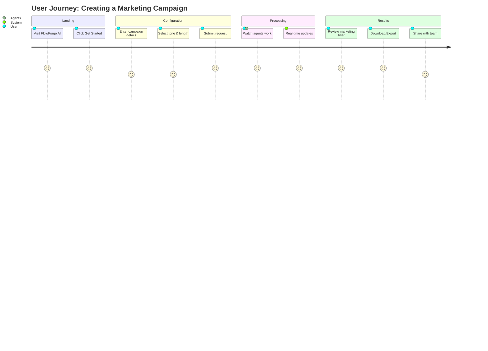

### 🖥️ User Interface Workflow

1. **Landing Page** → Click "Get Started"
2. **Campaign Form** → Fill in details:
   - Campaign name
   - Product/service description
   - Target audience
   - Tone: Professional / Casual / Enthusiastic
   - Length: Short / Medium / Long
3. **Progress View** → Watch real-time agent execution:
   - 🎯 Planner analyzing...
   - 🔍 Researcher gathering data...
   - ✍️ Writer creating content...
   - 🔎 Reviewer checking quality...
   - 📋 Assembler finalizing...
4. **Results Page** → View and export:
   - Executive summary
   - Full marketing brief
   - Download as Markdown

### 🔌 API Integration Examples

**Start Workflow**:
```bash
curl -X POST http://localhost:8000/api/workflow/start \
  -H "Content-Type: application/json" \
  -d '{
    "request": "Launch campaign for AI-powered productivity app targeting remote workers",
    "tone": "professional",
    "length": "medium",
    "format": "marketing brief"
  }'
```

**Response**:
```json
{
  "workflow_id": "uuid-here",
  "status": "started",
  "message": "Workflow started successfully"
}
```

**Stream Progress (SSE)**:
```bash
curl -N http://localhost:8000/api/workflow/stream/{workflow_id}
```

**Get Final Result**:
```bash
curl http://localhost:8000/api/workflow/result/{workflow_id}
```

**Response**:
```json
{
  "workflow_id": "uuid-here",
  "status": "completed",
  "result": {
    "title": "AI Productivity App Campaign",
    "summary": "Executive summary...",
    "body": "Full markdown content...",
    "raw": "Raw markdown text"
  },
  "from_cache": false,
  "execution_time": 45.2
}
```

---

## 📁 Project Structure

```
FlowForge-AI/
│
├── 📂 backend/                     # Python FastAPI Backend
│   ├── 📂 actions/                # Agent action implementations
│   │   ├── plan.py               # Planning logic
│   │   ├── research.py           # Research logic
│   │   ├── write.py              # Writing logic
│   │   ├── review.py             # Review logic
│   │   └── assemble.py           # Assembly logic
│   │
│   ├── 📂 agents/                 # Agent definitions
│   │   ├── planner_agent.py
│   │   ├── researcher_agent.py
│   │   ├── writer_agent.py
│   │   ├── reviewer_agent.py
│   │   └── assembler_agent.py
│   │
│   ├── 📂 flowforge_core/         # Core orchestration
│   │   ├── 📂 llm/               # LLM provider abstractions
│   │   ├── 📂 logs/              # Logging utilities
│   │   └── 📂 base/              # Base classes
│   │
│   ├── 📂 provider/               # LLM integrations
│   │   ├── gemini_api.py         # Gemini integration
│   │   └── base_provider.py     # Provider interface
│   │
│   ├── config.py                  # Configuration management
│   ├── main.py                    # FastAPI application
│   ├── orchestrator.py            # Workflow orchestrator
│   ├── schema.py                  # Pydantic schemas
│   └── requirements.txt           # Python dependencies
│
├── 📂 src/                        # React Frontend
│   ├── 📂 components/            # Reusable UI components
│   │   ├── AgentStatus.jsx       # Agent progress display
│   │   ├── AIChatbot.jsx         # AI chat interface
│   │   ├── Card.jsx              # Card component
│   │   ├── Button.jsx            # Button component
│   │   ├── Navbar.jsx            # Navigation bar
│   │   ├── Footer.jsx            # Footer component
│   │   └── Loader.jsx            # Loading animations
│   │
│   ├── 📂 pages/                 # Application pages
│   │   ├── LandingPage.jsx       # Home page
│   │   ├── CreateCampaign.jsx    # Campaign creator
│   │   ├── WorkflowProgress.jsx  # Real-time progress
│   │   ├── FinalBrief.jsx        # Results display
│   │   ├── Dashboard.jsx         # User dashboard
│   │   └── Settings.jsx          # Settings page
│   │
│   ├── 📂 context/               # React context
│   │   └── ThemeContext.jsx      # Dark/Light theme
│   │
│   ├── 📂 services/              # API services
│   │   └── api.js                # Backend API client
│   │
│   ├── App.jsx                    # Main app component
│   ├── main.jsx                   # Entry point
│   └── index.css                  # Global styles
│
├── 📂 public/                     # Static assets
├── render.yaml                    # Render.com config
├── package.json                   # Node dependencies
├── vite.config.js                # Vite configuration
├── tailwind.config.js            # Tailwind CSS config
├── .env.example                  # Environment template
├── RENDER.md                     # Deployment guide
└── README.md                     # This file
```

---

## 🛠️ Technology Stack

### 📊 Complete Tech Stack Diagram

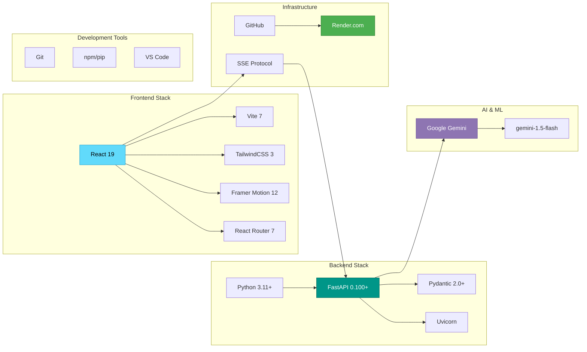

### 🔧 Technology Details

<table>
<tr>
<td width="50%">

#### Frontend Technologies
| Tech | Version | Purpose |
|------|---------|---------|
| **React** | 19 | UI framework |
| **Vite** | 7 | Build tool & dev server |
| **TailwindCSS** | 3 | Utility-first CSS |
| **Framer Motion** | 12 | Animations |
| **React Router** | 7 | Client routing |
| **React Markdown** | 10 | Markdown rendering |

</td>
<td width="50%">

#### Backend Technologies
| Tech | Version | Purpose |
|------|---------|---------|
| **FastAPI** | 0.100+ | Async API framework |
| **Pydantic** | 2.0+ | Data validation |
| **Uvicorn** | Latest | ASGI server |
| **Google Generative AI** | 0.3+ | Gemini SDK |
| **aiohttp** | 3.8+ | Async HTTP client |
| **python-dotenv** | 1.0+ | Environment config |

</td>
</tr>
</table>

### ⚙️ Configuration Options

**Backend (.env)**:
```bash
# LLM Configuration
LLM_PROVIDER=gemini
GEMINI_API_KEY=your_api_key_here
LLM_MODEL=gemini-1.5-flash
LLM_TEMPERATURE=0.7
LLM_MAX_TOKENS=2048
LLM_TIMEOUT=120

# Server Settings
HOST=0.0.0.0
PORT=8000
LOG_LEVEL=INFO

# Cache Settings (in code)
CACHE_MAX_SIZE=50
CACHE_TTL_SECONDS=1800
```

**Frontend**:
```bash
VITE_API_URL=http://localhost:8000
```

---

## 📊 Performance & Metrics

### ⚡ Performance Benchmarks

```mermaid
gantt
    title Campaign Generation Timeline
    dateFormat  ss
    axisFormat %S

    section Planning
    Planner Agent     :a1, 00, 8s
    
    section Research
    Researcher Agent  :a2, 08, 12s
    
    section Writing
    Writer Agent      :a3, 20, 15s
    
    section Review
    Reviewer Agent    :a4, 35, 8s
    
    section Assembly
    Assembler Agent   :a5, 43, 5s
```

### 📈 Performance Metrics

<table>
<tr>
<td width="50%">

#### Execution Times
| Scenario | Time | Cache | Notes |
|----------|------|-------|-------|
| **First Request** | 45-60s | ❌ | Full pipeline execution |
| **Cached Request** | <0.1s | ✅ | Instant from memory |
| **Cold Start** | 60-90s | ❌ | Render.com cold boot |
| **Single Agent** | 5-15s | ❌ | Per agent average |
| **Retry w/ Backoff** | +1-7s | ❌ | Exponential delay |

</td>
<td width="50%">

#### Resource Usage
| Resource | Usage | Limit | Status |
|----------|-------|-------|--------|
| **Memory** | ~150MB | 512MB | ✅ Normal |
| **CPU** | Low | Shared | ✅ Normal |
| **API Calls** | 5-10/req | 60/min | ✅ Normal |
| **Cache Size** | 50 entries | 50 max | ✅ Normal |
| **Response** | ~2-5KB | N/A | ✅ Normal |

</td>
</tr>
</table>

### 🎯 Optimization Tips

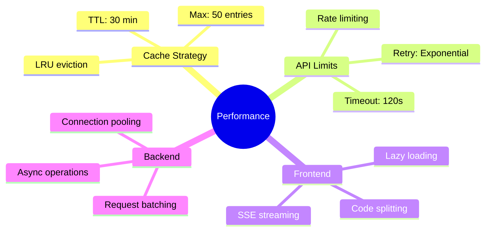

**Key Optimizations**:
- ✅ **Caching**: 50-entry LRU cache with 30-min TTL
- ✅ **Retry Logic**: Exponential backoff (1s → 2s → 4s)
- ✅ **Streaming**: Real-time SSE updates
- ✅ **Async**: Non-blocking FastAPI + aiohttp
- ✅ **Error Handling**: Graceful degradation

---

## 🐛 Troubleshooting Guide

### 🔍 Common Issues & Solutions

#### 1. Backend Won't Start

```bash
# Problem: Python version mismatch
python --version  # Must be 3.11+

# Solution: Use correct Python
python3.11 -m venv venv
source venv/bin/activate  # Linux/Mac
venv\Scripts\activate     # Windows
```

#### 2. API Key Invalid

```bash
# Problem: GEMINI_API_KEY not set
echo $GEMINI_API_KEY  # Should print key

# Solution: Set environment variable
export GEMINI_API_KEY="your-key-here"  # Linux/Mac
$env:GEMINI_API_KEY="your-key-here"    # Windows PowerShell
```

#### 3. Frontend Can't Connect

```bash
# Problem: CORS or wrong API URL
curl http://localhost:8000/health

# Solution: Check VITE_API_URL in .env
VITE_API_URL=http://localhost:8000  # Local
VITE_API_URL=https://api.render.com  # Production
```

#### 4. Render Deployment Issues

| Issue | Cause | Solution |
|-------|-------|----------|
| **Cold Start** | Service sleeping | Wait 60-90s for first request |
| **500 Error** | Missing env vars | Check `GEMINI_API_KEY` in Render dashboard |
| **Build Fails** | Wrong Python version | Ensure Python 3.11+ in `runtime.txt` |
| **CORS Error** | Frontend misconfigured | Update `VITE_API_URL` to backend URL |

#### 5. Workflow Stuck

```bash
# Check workflow status
curl http://localhost:8000/api/workflow/status/{workflow_id}

# Cancel stuck workflow (if implemented)
curl -X POST http://localhost:8000/api/workflow/cancel/{workflow_id}
```

### 🔧 Debug Checklist

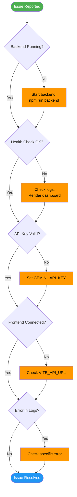

### 📝 Logging & Debugging

**Enable Debug Logging**:
```python
# backend/config.py
LOG_LEVEL = "DEBUG"  # Change from INFO
```

**View Logs**:
```bash
# Local
tail -f backend/logs/app.log

# Render
# Go to Dashboard → Service → Logs tab
```

**Common Log Messages**:
```
✅ INFO: Workflow started: workflow_id=abc123
✅ INFO: Agent completed: agent=planner, time=8.2s
⚠️ WARNING: Retry attempt 2/3 for agent=researcher
❌ ERROR: Gemini API error: Rate limit exceeded
```

---

## 🤝 Contributing

We welcome contributions! Here's how to get started:

### 📋 Contribution Workflow

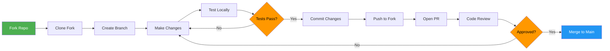

### 🛠️ Development Guidelines

**1. Fork & Clone**:
```bash
# Fork on GitHub, then:
git clone https://github.com/YOUR_USERNAME/FlowForge-AI.git
cd FlowForge-AI
```

**2. Create Feature Branch**:
```bash
git checkout -b feature/amazing-feature
# Or for bug fixes:
git checkout -b fix/bug-description
```

**3. Make Changes**:
- Follow existing code style
- Add comments for complex logic
- Update documentation if needed
- Test thoroughly locally

**4. Commit with Meaningful Messages**:
```bash
git add .
git commit -m "feat: Add amazing new feature"
# Use conventional commits:
# feat: New feature
# fix: Bug fix
# docs: Documentation
# style: Formatting
# refactor: Code restructure
# test: Add tests
# chore: Maintenance
```

**5. Push & Create PR**:
```bash
git push origin feature/amazing-feature
# Then create Pull Request on GitHub
```

### 📜 Code Standards

- **Python**: Follow PEP 8, use type hints
- **JavaScript**: Use ES6+, follow Airbnb style guide
- **Commits**: Use conventional commit messages
- **Tests**: Add tests for new features
- **Documentation**: Update README for user-facing changes

### 🎯 Areas for Contribution

| Area | Description | Difficulty |
|------|-------------|------------|
| **New Agents** | Add specialized agents | 🟢 Medium |
| **LLM Providers** | OpenAI, Claude, etc. | 🟡 Hard |
| **UI/UX** | Improve frontend design | 🟢 Easy |
| **Tests** | Add unit/integration tests | 🟢 Medium |
| **Documentation** | Improve guides/examples | 🟢 Easy |
| **Performance** | Optimize caching/speed | 🟡 Hard |

---


See [LICENSE](LICENSE) file for full details.

---

## 🙏 Acknowledgments

<table>
<tr>
<td align="center" width="25%">
<br>
<strong>Google Gemini</strong><br>
<sub>AI Foundation Model</sub>
</td>
<td align="center" width="25%">
<br>
<strong>FastAPI</strong><br>
<sub>Backend Framework</sub>
</td>
<td align="center" width="25%">
<br>
<strong>React</strong><br>
<sub>Frontend Library</sub>
</td>
<td align="center" width="25%">
<br>
<strong>Render</strong><br>
<sub>Cloud Deployment</sub>
</td>
</tr>
</table>

### 💡 Special Thanks

- **Vite** - Lightning-fast build tool
- **TailwindCSS** - Utility-first CSS framework
- **Framer Motion** - Production-ready animations
- **Pydantic** - Data validation library
- **Open Source Community** - For amazing tools and libraries

---


### Connect with Us

[](https://github.com/YatindraRai002/FlowForge-AI)
[](https://github.com/YatindraRai002/FlowForge-AI/issues)
[](https://github.com/YatindraRai002/FlowForge-AI/pulls)

</div>

---

<div align="center">

## 🚀 Ready to Transform Your Marketing?

**Start creating AI-powered campaigns in minutes!**

[](https://render.com/deploy)
[](https://flowforge-ai.onrender.com)
[](https://github.com/YatindraRai002/FlowForge-AI)

---

**Built with ❤️ by the FlowForge AI Team**

**Powered by Google Gemini | React | FastAPI**

[⬆ Back to Top](#-flowforge-ai---multi-agent-marketing-campaign-generator)

</div>
